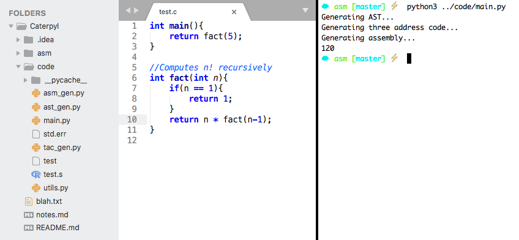
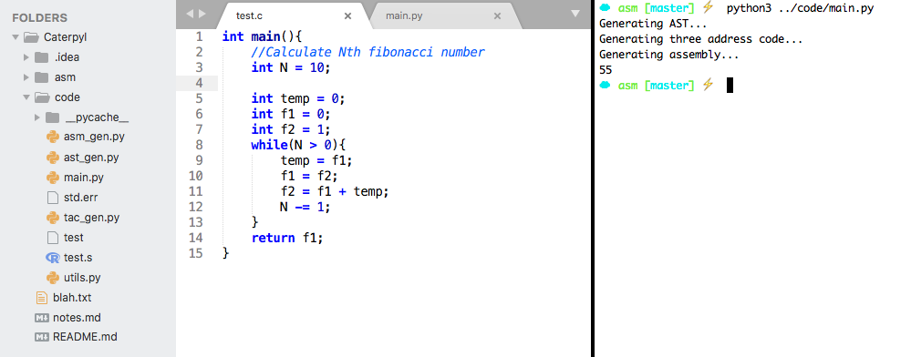
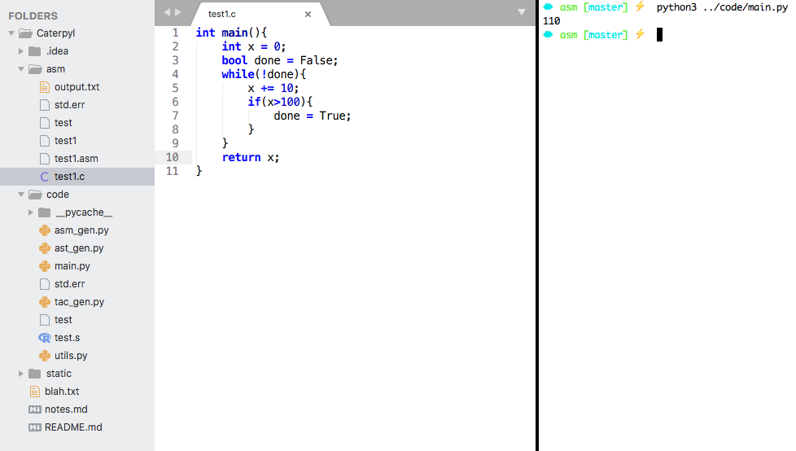
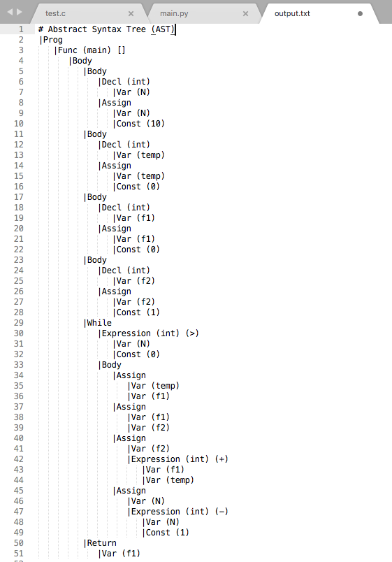
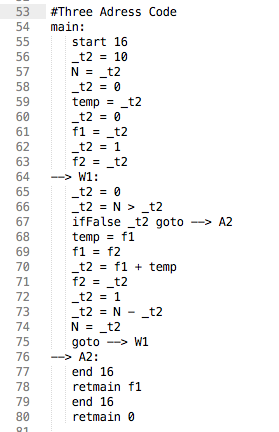
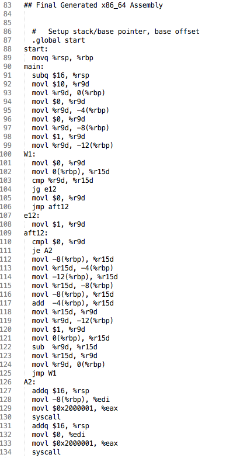

# Caterpyl

Caterpyl is a compiler I'm writing from scratch to compile a core subset of C into x86_64 assembly.

Currently, it supports the following features:
- two types: `int` and `bool` 
- variables, literals, expressions (`int y = (2 * 10 + 7 * (3 + 1)) - 200;`, `bool broken = False;`)
- boolean operators (`&&`, `||`, `!`)
- arithmetic operators (`+`, `*`, `-`, `/`, `%`)
- comparators (eg. `==`, `<`, `>`, `<=`, `>=`, `!=`)
- user defined functions (`int my_func(){ return 123; }`)
- control structures (`if`, `else`, `while`)
- comments (`//`)
- type checking

** Notes **
- Language modified slightly to support `True` and `False` instead of `1` and `0` as booleans

## Some screenshots...

